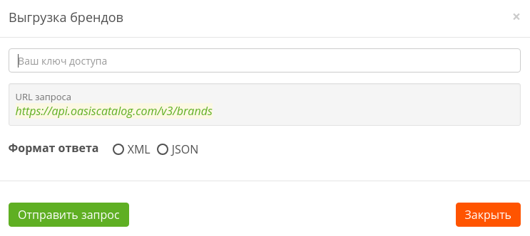

# Формат запроса

```text
https://api.oasiscatalog.com/v3/brands
```

[**https://api.oasiscatalog.com/v3**](https://www.gitbook.com/book/oasiscatalog/api-oasis/edit#) - основной url

**brands** - экспорт остатков

**format** - параметр, формат выгрузки \(xml или json\).

> ### Обратите внимание
>
> Для выгрузки брендов **не** используется постраничная навигация.

## Пример запроса



