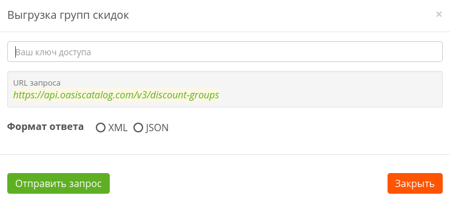

# Формат запроса

```text
https://api.oasiscatalog.com/v3/discount-groups?format=xml
```

[**https://api.oasiscatalog.com/v3**](https://www.gitbook.com/book/oasiscatalog/api-oasis/edit#) - основной url

**discount-groups** - экспорт групп скидок

**format** - параметр, формат выгрузки \(xml или json\).

## Пример запроса



