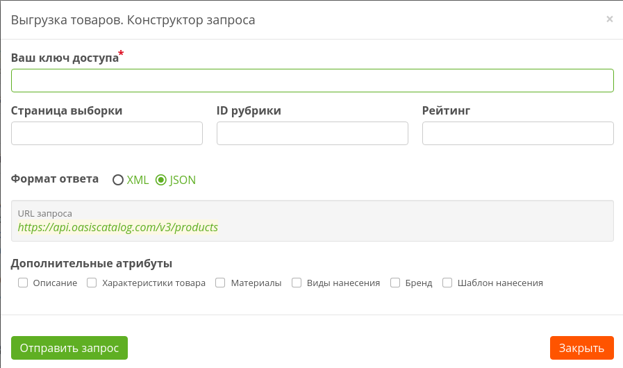

# Формат запроса

```text
https://api.oasiscatalog.com/v3/products?page=5&category=1325&rating=3&expand=attributes,materials
```

[**https://api.oasiscatalog.com/v3**](https://www.gitbook.com/book/oasiscatalog/api-oasis/edit#) - основной url

**articles** - список артикулов товаров. В качестве значения, может содержать список \(через запятую\) необходимых артикулов.

**format** - формат выгрузки \(xml или json\).

**currency** - параметр позволяет получить выгрузку товаров в указанной валюте. Ознакомьтесь со [списком](https://oasiscatalog.gitbooks.io/api-oasis/content/api-documentation-v3/obschie-svedeniya/format-valyut-v-zaprose.html) возможных валютных форматов.

**page** - параметр, указывающий порядковый номер очередной порции данных

**warehouse** - фильтр по конкретному складу \(подразумевается id-склада\)

**category -**  параметр, указывающий ID рубрики. Ответ будет содержать товары, которые находятся в указанной категории и всех её внутренних подкатегориях.

**rating** - рейтинг товаров. Ответ будет содержать товары указанного рейтинга.

**expand** - параметр, позволяющий получить более развёрнутый и детализированный ответ. В качестве значения, может содержать список \(через запятую\) необходимых атрибутов

* **description** - подробное описание товара
* **attributes** - характеристики товара: вес, размер и др.
* **materials** - материалы, из которых изготовлен товар
* **branding** - виды нанесения, возможные для этого товара
* **brand** - бренд, под маркой которого выпущен товар
* **cdr** - ссылка на шаблон нанесения в формате cdr
* **package** - информация об упаковке
* **branding\_option** - опции для нанесения. В качестве значения, может содержать список \(через запятую\) необходимых идентификаторов.

## Пример запроса

##  <a id="&#x43F;&#x440;&#x438;&#x43C;&#x435;&#x440;"></a>

