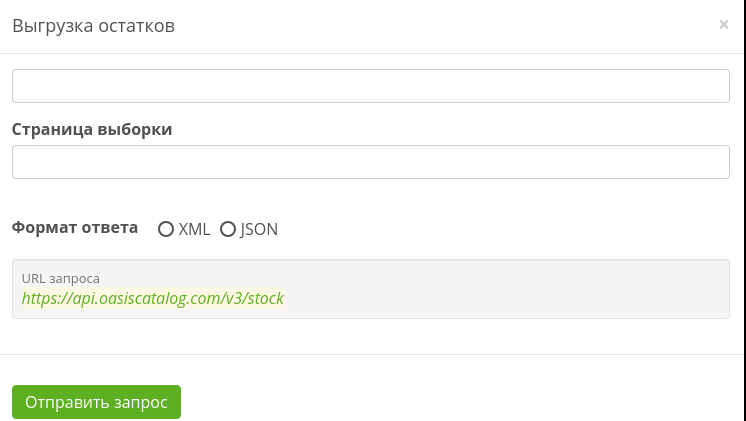

# Формат запроса

```text
https://api.oasiscatalog.com/v3/stock?page=2
```

[**https://api.oasiscatalog.com/v3**](https://www.gitbook.com/book/oasiscatalog/api-oasis/edit#) - основной url

**stock** - экспорт остатков

**page** - параметр, указывающий порядковый номер очередной порции данных

## Пример запроса



