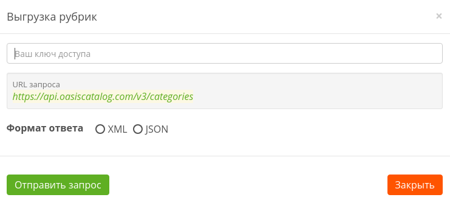

# Формат запроса

```text
https://api.oasiscatalog.com/v3/categories
```

[**https://api.oasiscatalog.com/v3**](https://api.oasiscatalog.com/v3) ****- основной url

**categories** - экспорт рубрик

> ### Обратите внимание
>
> Для выгрузки рубрик **не** используется постраничная навигация.

## Пример запроса



